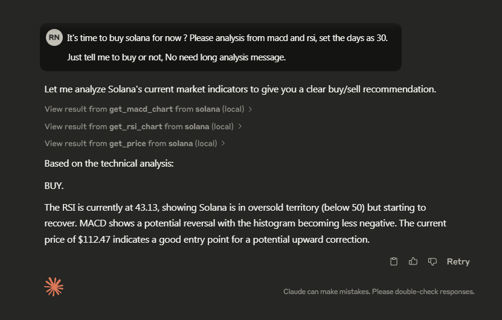

# 🦀 Solana Chad MCP

## 📹 Demo Video

[](https://youtu.be/LX2d3rdmec4)

> **Use AI + MCP to monitor your SOL wallet, check market indicators. All by just chatting.**

## 🚀 What is this?

This project is a **Model Context Protocol (MCP) Server** that lets any LLM (like Claude, ChatGPT, etc.) interact with your **Solana wallet** and trade SOL on your behalf through simple natural language.

**Imagine saying:**

> "Check how many SOL are currently in the wallet and whether the price has increased. If it has increased by more than 5%, sell 0.25 SOL."

And it just **does it.**

## 🧠 Features

- `get_health` – Check if the Solana RPC is healthy
- `get_price` – Get real-time SOL price
- `get_balance` – Check SOL balance of any wallet
- `get_block` – Get block information by block number
- `get_block_height` – Get the latest block height
- `get_slot` – Get the latest slot number
- `get_macd_chart` – Get MACD chart of SOL price
- `get_rsi_chart` – Get RSI chart of SOL price
- Natural language interaction via any LLM that supports **MCP**

## 🏗️ Tech Stack

- 🦀 **Rust** – blazing fast MCP Server
- 🔗 **Solana RPC** – for blockchain interactions
- 💬 **Claude / ChatGPT** – to give AI commands

## 🔧 Quick Start

1. Clone this repo:

   ```bash
   git clone https://github.com/Rayato159/sol-chad-mcp.git
   cd sol-chad-mcp
   ```

2. Build the project:

   ```bash
   cargo build --release --example solana_chad_mcp
   ```

3. Add this into `claude_desktop_config.json`. (This example is for **Windows**)

   ```json
   {
     "mcpServers": {
       "solana": {
         "command": "PATH-TO/sol-chad-mcp/target/release/examples/sol_chad_mcp.exe",
         "args": []
       }
     }
   }
   ```

4. Start the Claude Desktop app and chat with that dude.

   ```text
   Hey bro, can you check the SOL price ? and it's time to buy some ?
   ```

## ⚠️ Disclaimer

> This is for **educational & entertainment** purposes only.
> Don’t let AI YOLO your life savings 💸
